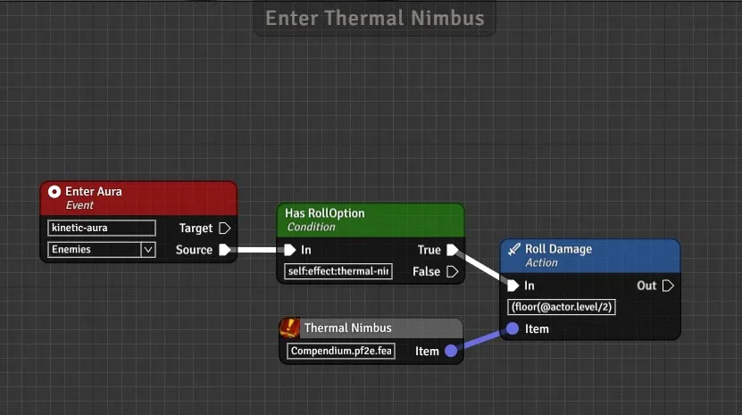

# FoundryVTT PF2e Trigger

 or [Stripe](https://buy.stripe.com/cN23dy0hd0gW5nq3cc) directly

This module helps you generate triggers by pairing events with conditions and actions. You can find the menu to create the triggers in the settings.

<!-- # WIKI

You can find all the details about this module in its [WIKI](https://github.com/reonZ/pf2e-trigger/wiki) -->

# CHANGELOG

You can see the changelog [HERE](https://github.com/reonZ/pf2e-trigger/blob/master/CHANGELOG.md)
